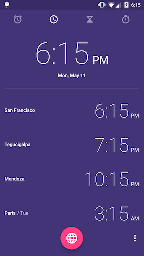
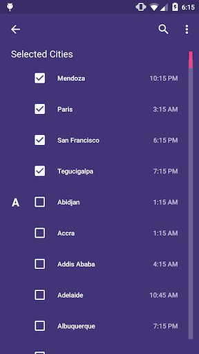
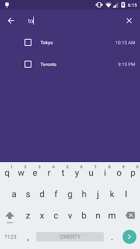

# Clockette, a World Clock Web Application

## Main Components (Screens)

### HomeScreen

> *Home Screen (Clock App, Google Android Lollipop)*

The "Home" Screen is composed by:

- a regular digital clock, displaying the current time and date
- a list of hand-picked time-zones, displaying their according time
- if a time-zone according day is different than the current one, we display its day abbreviation next to the time-zone city name
- a floating centered button
    - on click → go to Add Timezone Screen

### AddTimezoneScreen

> *Add Timezone Screen (Clock App, Google Android Lollipop)*

The "Add Timezone" Screen is composed by:

- a back button
    - on click → come back to the Home Screen
- a search button, with a magnifying glass icon
    - on click → hide the icon, expand a text input
- a list of hand-picked time-zones, displaying their according time
- a list of available time-zones, displaying the time-zone city name, and the corresponding time
- each time-zone can be selected or unselected. A corresponding checkbox will display the selected status of the time-zone
- when selecting a time-zone:
    - the checkbox gets selected
    - the time-zone is added to the top list of the user's picks
    - the time-zone isn't removed from the available list
    - also, the view doesn't scroll because of the user's picks update

### SearchTimezoneScreen

> *Search Screen (Clock App, Google Android Lollipop)*

The "Search Timezone" Screen is composed by:

- a back button
    - on click → go to Add Timezone Screen
- a text input
    - on change → trigger a search event to be catched by the following list
- a time-zone list filtered by the text-input value
- if text input value is blank, it shows the Add Timezone Screen by default

## Shared Components

### Timezone
`<Timezone/>` is responsible of formatting and displaying a date/ time depending on certain parameters:

##### `ts`  `string|number` *(optional)*
Timestamp of a desired date to format. By default, it'll fallback to the current date.

    <Timezone ts="1430741520000">h:mm A</Timezone> 
     ↳ 12:12 PM

##### `zone` `string` *(optional)*
Moment-like time-zone format (@see [http://momentjs.com/timezone/](http://momentjs.com/timezone/))

    // UTC current time: 12:12 PM
    <Timezone zone="America/Los_Angeles">h:mm A</Timezone>
     ↳ 5:12 AM

##### `offset` `string|number` *(optional)*
> The time-zone offset is the difference, in minutes, between UTC and
> local time. Note that this means that the offset is positive if the
> local timezone is behind UTC and negative if it is ahead. For example,
> if your time zone is UTC+10 (Australian Eastern Standard Time),
>  -600 will be returned. Daylight saving time prevents this value
> from being a constant even for a given locale.  
> JavaScript: `Date.prototype.getTimezoneOffset()`  
> Source: [Mozilla Developer Network](https://developer.mozilla.org/en-US/docs/Web/JavaScript/Reference/Global_Objects/Date/getTimezoneOffset)
 
    // UTC current time: 12:12 PM
    <Timezone offset="420">h:mm A</Timezone>
     ↳ 5:12 AM

     
## Data Storage
We're gonna follow the Flux rules to manage data: all data will be CRUD in **stores** only.

Two stores for that:

##### TimezoneStore
Containing the list of available timezones

##### UserStore
Containing user picked time-zones and general preferences. **UserStore** will be saved in user browser's LocalStorage

##### Timezone
A Timezone Object will be pre-processed from [Moment-Timezone Zone Object](http://momentjs.com/timezone/docs/#/zone-object/):

    // Moment-Timezone Zone Object
    {
        name    : 'America/Los_Angeles',          // the unique identifier
        abbrs   : ['PDT', 'PST'],                 // the abbreviations
        untils  : [1414918800000, 1425808800000], // the timestamps in milliseconds
        offsets : [420, 480]                      // the offsets in minutes
    }
    
    // → Custom Timezone Object
    {
        zone: 'America/Los_Angeles',   // the unique identifier
        city: 'los angeles',           // zone's last segment, lowercase, underscores removed
        offset: 420                    // pre-calculated offset based on the current timestamp
    }
    
We'll mostly use the offset to curry the creation of Timezone Components. Because each zone is unique but offset are shared between more than one city, we'll curry a function with the same timestamp and offset to return one instance per offset, instead one instance per zone id.

### Immutability
In order to enforce state consistency and ensure data flow will be unique, without data collision, we'll give a try at Facebook's [immutable.js](https://github.com/facebook/immutable-js) library:

> Immutable data cannot be changed once created, leading to much simpler application development, no defensive copying, and enabling advanced memoization and change detection techniques with simple logic. Persistent data presents a mutative API which does not update the data in-place, but instead always yields new updated data.

Then, data comparison performance will be highly improved by performing a memory reference comparison, instead of a content comparison, avoiding key, length comparisons, costly casting...

    var Immutable = require('immutable');
    var map1 = Immutable.Map({a:1, b:2, c:3});
    var map2 = map1.set('b', 50);
    map1.get('b'); // 2
    map2.get('b'); // 50
    map1 === map2 // false